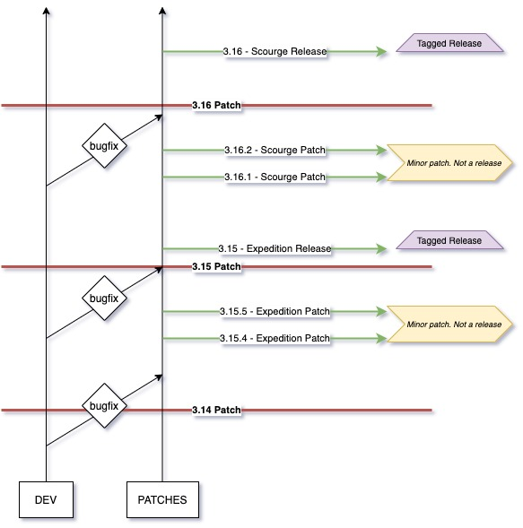

## What's this?

This is a working guide on how to contribute to this repository. It is here so that you could confidently help us with developing PyPoE and make patches/pull requests.
If you have any questions - please message on the [#tools-dev](https://discord.gg/juZ2dUZY) channel in our discord server.

## How does the branching model work?

We have two main branches - `dev` and `patches`. Below is a non-exhaustive explanation on how they work.

This is the branching model:



### DEV

This branch is here for generic improvements/enhancements/bugfixes that are not related to anything that touches the schema or mappers for `dat` files. So if you are looking to add general fixups or some new code that helps PyPoE run better, more efficiently or solves some annoying bug, any pull requests should be raised with `dev` as the target branch.

Please avoid mixing schema work into dev as dev later gets merged into patches at key milestones, and any such changes could conflict with other people's schema changes.

### PATCHES

The `patches` branch is there so you could commit any schema/mapper work related to PyPoE, these are blocks of code that help PyPoE infer the `dat` file data and structure, and have nothing to do with the I/O or general processing section of this repo (those live in `dev`).

When committing to `patches` please make sure you do not cross-contaminate it with generic fixes or bugfixes that don't relate to schema work as those should go into dev.

## Releases

When we are working on certain patches, while we are not ready to say "this release is fully finished" we can still tag key milestones for them using git tags. In this case, you should tag your pre-release following this convention:

`major.minor.patch leaguename patch`

for instance

`3.15.4 Expedition Patch`

Whereas when you are ready to release, you should instead use this convention for tagging:

`major.minor leaguename release`

such as:

`3.15 Expedition Release`

In order to tell whether you should release something, there needs to be a discussing with fellow developers in the [#tools-dev](https://discord.gg/juZ2dUZY) channel of our discord.

## Contribution and PRs

### Commits
When making commits to your personal fork that you intend to push to our branches, we ask that you keep your commit messages clean and informative. Here are some examples of bad commit messages for a piece of code:

`code:`
```py
def my_excellent_method(arg:int):
    return arg + 1

# >>>>>>

def addone(arg:int) -> int:
    """Adds one to the passed in integer argument."""
    return arg + 1
```

`bad commit examples:`
- `...`
- `commit`
- `Changed method`
- `Improved function`

`good commit examples:`
- `Renamed my_excellent_method and added docstring explaining what it does`
- `Refactored my_excellent_method, added docstring, and return type`

Keep them sweet, but informative and meaningful.

### Pull requests

When creating PRs, you should be given a PR template when creating a PR on git, please follow it and fill it in appropriately, giving as much information as possible based on the size of your commits and quantity of code changed.

### Caution

We want to bring this repo to a good state and as such the quality of work both within the codebase and within git are paramount and as such we will be rejecting any commits/PRs if they do not meet our quality standards. We may also ask you to change them before rejecting, so you have a chance to have them accepted once changes are made to comply with our quality policy.

## How to pull/push?

If you want to checkout a particular branch you should first fetch from the remote, by using `git fetch` after you've cloned the repo. Then you can simply checkout using `git checkout dev` or `git checkout patches` depending on which one of those you want as a base for your work.

Let's say you want to submit some fixes for the general code, then you should do:

```sh
git checkout dev                # check out the remote branch
git pull origin dev             # pull latest changes from remote
git checkout -b "branchname"    # make a new branch from this one with a name you chose.
```

Once you are ready to push your changes, do the following:

```sh
git add file1 file2 file3           # Add the files you changed
git commit -m "my nice commit msg"  # make a commit
git push origin dev                 # push your changes to our remote as a pull req
```

After that you should be given a URL inside of your CLI which you can follow to finalise the pull request on github.

It is imperative that you set your target branch correctly in git, so make sure that your PR says:

Merge changes into `wiki/pypoe/dev` from `you/somebranch` for instance.
If something isn't clear, please message us on discord and we will be happy to assist!